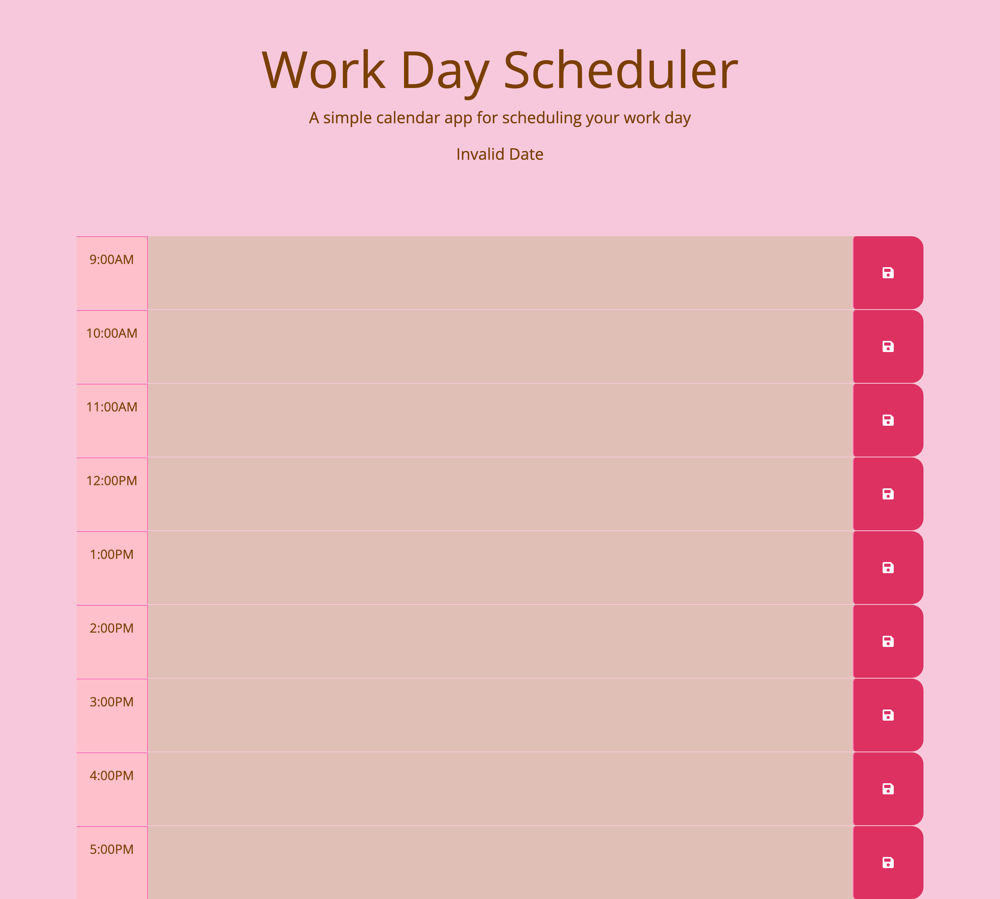

# daily-planner

## Description
In this challenge we are asked to make a daily planner to help plan out a 9-5 work day schedule. The plan that was input needed to be saved into local storage and stay on the page when the page is refreshed, the hour time blocks also need to change colors based on the current time. For this challenge like my last challenge i struggled the most with the local storage aspect.

## Installation
The first thing I did to finish this project was to get the current date and time because that was the easiest. The next thing I did was finish all the time blocks and change some of the HTML. Once that was done I figured out how to make the colors on the time blocks to change color based on the current time and set the 'past' 'present' and 'future' classes to the time blocks. After that was finished I spent the most time on the local storage to get it to stay on the page. Inbetween these steps when I felt I needed a break or was stuck on something I worked on the css stylesheet.

## Usage 
The application works by typing a todo in text boxes for the hour you need to do that todo and click the save button, when the save button is clicked the todo saves to local storage and appears on the page even when the page is refreshed.

link to deployed application: https://heeyitsrissa.github.io/daily-planner/

screenshot of deployed application: 

## License 

